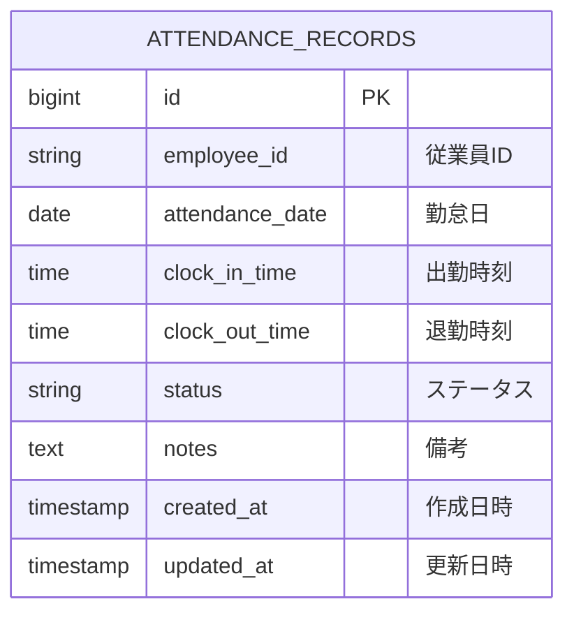

# テーブル定義書

システムのデータベーステーブル定義を管理します。

## 命名規則

### テーブル名

- **形式**: 小文字スネークケース (例: `favorites`, `product_reviews`)
- **複数形**: 原則として複数形を使用
- **命名規則**: ビジネス用語を使用、省略形は避ける

---

## ハイレベル設計

### エンティティ一覧

| 項番 | データベース  | 論理エンティティ名                                | 物理エンティティ名 | 備考                 |
| ---- | ------------- | ------------------------------------------------- | ------------------ | -------------------- |
| 1    | attendance_db | [勤怠レコード](#1-勤怠レコードattendance_records) | attendance_records | 従業員の日次勤怠情報 |

### ER図



---

## ローレベル設計

### テーブル詳細定義

#### 1. 勤怠レコード（`attendance_records`）

**テーブル概要**:
- 従業員の日次勤怠情報を管理するメインテーブル
- 出勤・退勤時刻、休暇情報、勤怠ステータスを記録
- 関連要件: REQ-UC001（システム起動）, REQ-UC002（カレンダー操作）, REQ-UC003（勤務時間入力）, REQ-UC004（休暇登録）

**テーブル構造**:

| カラム名        | 論理名     | データ型    | Not Null | 既定値            | 説明                                                                                      |
| --------------- | ---------- | ----------- | -------- | ----------------- | ----------------------------------------------------------------------------------------- |
| id              | ID         | BIGINT      | ✓        | AUTO_INCREMENT    | 勤怠レコードの一意識別子（主キー）                                                        |
| employee_id     | 従業員ID   | VARCHAR(50) | ✓        | -                 | 従業員を識別するID<br/>例: "EMP001"                                                       |
| attendance_date | 勤怠日     | DATE        | ✓        | -                 | 勤怠記録の対象日<br/>形式: YYYY-MM-DD                                                     |
| clock_in_time   | 出勤時刻   | TIME        |          | NULL              | 出勤時刻<br/>形式: HH:MM:SS<br/>休暇の場合はNULL                                          |
| clock_out_time  | 退勤時刻   | TIME        |          | NULL              | 退勤時刻<br/>形式: HH:MM:SS<br/>休暇の場合はNULL                                          |
| status          | ステータス | VARCHAR(20) | ✓        | 'WORK'            | 勤怠ステータス<br/>値: 'WORK'（出勤）, 'PAID_LEAVE'（有給休暇）, 'SICK_LEAVE'（病欠）など |
| notes           | 備考       | TEXT        |          | NULL              | 勤怠に関する追加情報やメモ<br/>最大長: 制限なし                                           |
| created_at      | 作成日時   | TIMESTAMP   | ✓        | CURRENT_TIMESTAMP | レコード作成日時<br/>自動設定                                                             |
| updated_at      | 更新日時   | TIMESTAMP   | ✓        | CURRENT_TIMESTAMP | レコード最終更新日時<br/>更新時に自動更新                                                 |

**制約・キー**:

##### 主キー (Primary Key)

| 制約名                | カラム | 説明                     |
| --------------------- | ------ | ------------------------ |
| pk_attendance_records | id     | 勤怠レコードの一意識別子 |

##### 一意キー (Unique Key)

| 制約名                      | カラム                       | 説明                                                   |
| --------------------------- | ---------------------------- | ------------------------------------------------------ |
| uk_attendance_employee_date | employee_id, attendance_date | 同じ従業員の同じ日付に複数の勤怠レコードを作成できない |

##### チェック制約 (Check Constraint)

| 制約名                     | 条件                                                                               | 説明                                   |
| -------------------------- | ---------------------------------------------------------------------------------- | -------------------------------------- |
| chk_attendance_status      | status IN ('WORK', 'PAID_LEAVE', 'SICK_LEAVE', 'UNPAID_LEAVE')                     | ステータスは定義された値のみ許可       |
| chk_attendance_clock_times | clock_out_time IS NULL OR clock_in_time IS NULL OR clock_out_time >= clock_in_time | 退勤時刻は出勤時刻以降である必要がある |

##### インデックス (Index)

| インデックス名               | カラム                       | 種別       | 説明                                                 |
| ---------------------------- | ---------------------------- | ---------- | ---------------------------------------------------- |
| idx_attendance_employee      | employee_id                  | Non-Unique | 従業員IDでの検索を高速化                             |
| idx_attendance_date          | attendance_date              | Non-Unique | 日付での検索を高速化                                 |
| idx_attendance_employee_date | employee_id, attendance_date | Unique     | 従業員と日付の複合検索を高速化（一意キーとして機能） |

**カラム詳細説明**:

##### `status`（ステータス）の値定義

| 値           | 説明     | clock_in_time | clock_out_time | 備考           |
| ------------ | -------- | ------------- | -------------- | -------------- |
| WORK         | 出勤     | 必須          | 必須           | 通常の勤務日   |
| PAID_LEAVE   | 有給休暇 | NULL          | NULL           | 有給休暇取得日 |
| SICK_LEAVE   | 病欠     | NULL          | NULL           | 病気による欠勤 |
| UNPAID_LEAVE | 無給休暇 | NULL          | NULL           | 無給の休暇     |

**データ例**:

```sql
-- 通常の出勤
INSERT INTO attendance_records (employee_id, attendance_date, clock_in_time, clock_out_time, status, notes)
VALUES ('EMP001', '2024-11-18', '09:00:00', '18:00:00', 'WORK', NULL);

-- 有給休暇
INSERT INTO attendance_records (employee_id, attendance_date, clock_in_time, clock_out_time, status, notes)
VALUES ('EMP001', '2024-11-19', NULL, NULL, 'PAID_LEAVE', '家族旅行');

-- 病欠
INSERT INTO attendance_records (employee_id, attendance_date, clock_in_time, clock_out_time, status, notes)
VALUES ('EMP001', '2024-11-20', NULL, NULL, 'SICK_LEAVE', '風邪のため');
```

**関連要件とテーブル利用**:

| 要件      | 操作          | 説明                                                                                   |
| --------- | ------------- | -------------------------------------------------------------------------------------- |
| REQ-UC001 | -             | システム起動時はテーブルにアクセスしない（画面表示のみ）                               |
| REQ-UC002 | SELECT        | カレンダー操作は現在フロントエンドのみで完結。将来的に勤怠データを取得して表示する予定 |
| REQ-UC003 | INSERT/UPDATE | 勤務時間入力時にレコードを作成または更新                                               |
| REQ-UC004 | INSERT/UPDATE | 休暇登録時にレコードを作成または更新                                                   |

**REQ-UC002（カレンダー操作）の詳細**:

現在の実装では、カレンダーの日付選択と月切り替えはフロントエンド側の状態管理のみで実現されており、データベースへのアクセスは発生しません。

将来の拡張として、以下のクエリパターンが想定されます:

```sql
-- 従業員の勤怠レコード一覧を取得（カレンダーに勤怠状態を表示する場合）
SELECT * FROM attendance_records
WHERE employee_id = 'EMP001'
ORDER BY attendance_date DESC;

-- 特定月の勤怠レコードを取得
SELECT * FROM attendance_records
WHERE employee_id = 'EMP001'
  AND attendance_date >= '2024-11-01'
  AND attendance_date <= '2024-11-30'
ORDER BY attendance_date ASC;

-- 特定日の勤怠レコードを取得
SELECT * FROM attendance_records
WHERE employee_id = 'EMP001'
  AND attendance_date = '2024-11-18';
```

これらのクエリは、既存のインデックス（`idx_attendance_employee_date`）により効率的に実行されます。

**備考**:

- `employee_id`は将来的に従業員マスターテーブルの外部キーとなる予定
- `created_at`と`updated_at`はデータベーストリガーまたはJPAの`@CreatedDate`、`@LastModifiedDate`アノテーションで自動設定
- テーブル作成DDLは`backend/init-db/01-schema.sql`に定義
