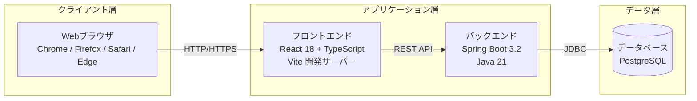

# デプロイメント図

システムの物理的な配置構成を定義します。

## 命名規則

### ノード名

- **形式**: PascalCase (例: `WebServer`, `DatabaseServer`)
- **命名規則**: 役割が明確になるように命名

## デプロイメント図

## 構成要素詳細

### Webブラウザ

* **概要**: ユーザーがアクセスするクライアントアプリケーション
* **ソフトウェア**: Chrome、Firefox、Safari、Edge（最新版）
* **対応プラットフォーム**: Windows、macOS、Linux
* **要件**: JavaScript有効、モダンブラウザ（ES2020以降対応）

### フロントエンド

* **概要**: ユーザーインターフェースを提供するReactアプリケーション
* **技術スタック**: React 18、TypeScript、Vite
* **ポート**: 5173（開発環境）
* **配置場所**: 開発環境ではVite開発サーバー、本番環境では静的ファイルとしてWebサーバーに配置
* **開発環境スペック**: CPU 4コア以上、8GB RAM、50GB空き容量
* **本番環境スペック**: WebサーバーまたはCDN経由で配信（想定: 4vCPU, 16GB RAM）

### バックエンド

* **概要**: ビジネスロジックとデータアクセスを提供するAPIサーバー
* **技術スタック**: Spring Boot 3.2、Java 21、Spring Data JPA、Maven
* **ポート**: 8080
* **配置場所**: アプリケーションサーバー（開発環境ではローカル、本番環境ではクラウド）
* **開発環境スペック**: CPU 4コア以上、8GB RAM、50GB空き容量
* **本番環境スペック**: 4vCPU以上、16GB RAM、SSDストレージ
* **冗長構成**: 本番環境では2台以上の構成を推奨

### データベース

* **概要**: 勤怠レコードを永続化するデータストア
* **ソフトウェア**: PostgreSQL（バージョンは最新安定版を推奨）
* **ポート**: 5432
* **配置場所**: 開発環境ではDocker Compose、本番環境ではマネージドDBサービスまたは専用DBサーバー
* **開発環境スペック**: Docker環境で動作
* **本番環境スペック**: 8vCPU以上、32GB RAM、バックアップ付きSSD
* **冗長構成**: 本番環境ではMulti-AZ構成またはレプリケーション構成を推奨
* **バックアップ**: 定期的なバックアップと復旧手順の整備

## 開発環境構成

開発環境では以下の構成を使用：

- **フロントエンド**: Viteの開発サーバーで起動（HMR有効）
- **バックエンド**: Spring Bootアプリケーションをローカルで起動
- **データベース**: Docker Composeで起動したPostgreSQLコンテナ

## 本番環境構成

本番環境では以下の構成を推奨：

- **フロントエンド**: ビルド済み静的ファイルをWebサーバー（nginx等）またはCDNで配信
- **バックエンド**: アプリケーションサーバー上でSpring Bootアプリケーションを実行（複数インスタンス推奨）
- **データベース**: マネージドDBサービス（AWS RDS等）またはレプリケーション構成の専用DBサーバー
- **ロードバランサー**: 複数のバックエンドインスタンス間の負荷分散
- **ネットワーク**: HTTPS通信による暗号化
