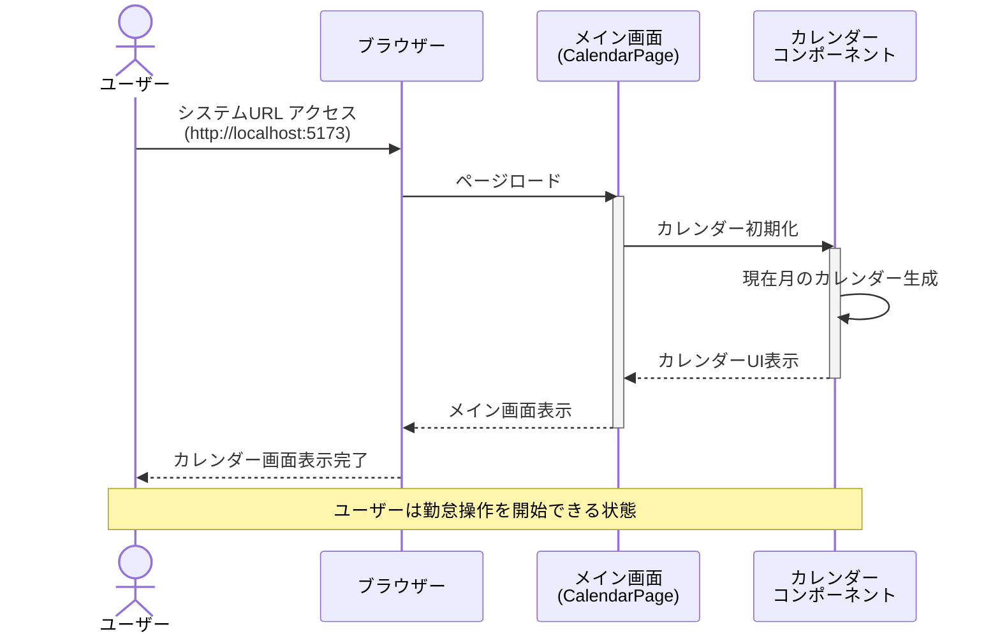
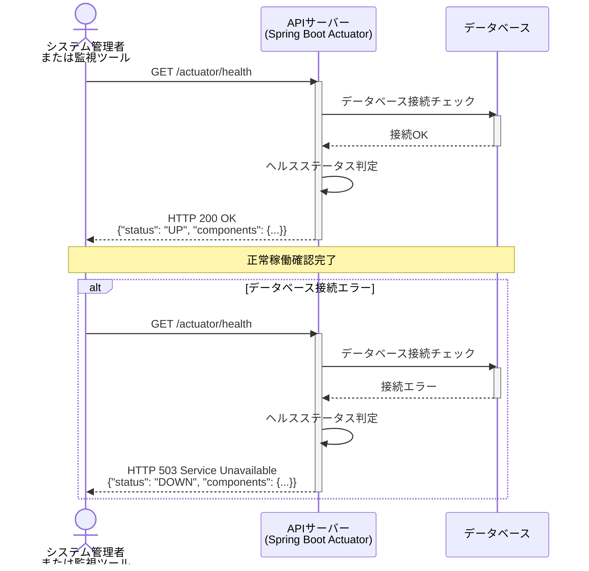

# シーケンス図

システムのコンポーネント間のやり取りを時系列で定義します。

## 命名規則

### シーケンス図ID

- **形式**: `SEQ-{連番3桁}` (例: `SEQ-001`)
- **命名規則**: フローの目的が明確になるように命名

## シーケンス図一覧

| シーケンス図ID | タイトル               | 概要                                               | 関連要件  | 関連画面 |
| -------------- | ---------------------- | -------------------------------------------------- | --------- | -------- |
| SEQ-001        | メイン画面表示         | ユーザーがシステムにアクセスしメイン画面を表示する | REQ-UC001 | SCR-001  |
| SEQ-002        | システムヘルスチェック | システムの稼働状況を確認する                       | REQ-UC001 | -        |

---

## シーケンス図詳細

### SEQ-001: メイン画面表示

#### 目的

* ユーザーがシステムURLにアクセスし、カレンダーを含むメイン画面を表示する
* 勤怠操作を開始できる状態にする

#### 範囲

* **トリガー**: ユーザーがブラウザーでシステムURL（http://localhost:5173）にアクセス
* **含むコンポーネント**: 
  - フロントエンド: ブラウザー、メイン画面（CalendarPage）、カレンダーコンポーネント
  - バックエンド: APIサーバー、データベース
* **除外**: 認証・認可処理（将来実装）

#### 前提条件

* システム（フロントエンド・バックエンド・データベース）が正常に稼働していること
* ユーザーがWebブラウザー（Chrome、Firefox、Safari、Edge最新版）を起動していること

#### 事後条件

* メイン画面が正常に表示されること
* カレンダーUIが表示されること
* ユーザーが勤怠操作（日付選択、勤務時間入力、休暇登録）を開始できる状態になること

#### 基本フロー

1. ユーザーがブラウザーでシステムURL（http://localhost:5173）にアクセスする
2. フロントエンドがメイン画面（CalendarPage）をロードする
3. CalendarPageがカレンダーコンポーネントを初期化する
4. カレンダーコンポーネントが現在の月のカレンダーを生成する
5. ブラウザーがメイン画面を表示する
6. ユーザーが勤怠操作を開始できる状態になる

#### 代替フロー

* **A1: システムが起動していない** — エラーページまたは接続エラーメッセージが表示される
* **A2: ブラウザーが非対応** — 画面が正しく表示されない可能性があるが、最新ブラウザーでの動作を前提とする

#### シーケンス図

---

### SEQ-002: システムヘルスチェック

#### 目的

* システム管理者がシステムの稼働状況を確認する
* システム監視ツールが定期的にシステムの正常性を確認する

#### 範囲

* **トリガー**: システム管理者または監視ツールがヘルスチェックエンドポイント（/actuator/health）にアクセス
* **含むコンポーネント**: 
  - フロントエンド: なし（直接APIにアクセス）
  - バックエンド: Spring Boot Actuatorエンドポイント、データベース接続チェック
* **除外**: 詳細な監視項目（CPU、メモリ等）

#### 前提条件

* システムが起動していること
* ヘルスチェックエンドポイントが有効化されていること

#### 事後条件

* システムの稼働状況（UP/DOWN）が返されること
* データベース接続状態が確認されること

#### 基本フロー

1. システム管理者または監視ツールがヘルスチェックエンドポイント（/actuator/health）にGETリクエストを送信する
2. APIサーバー（Spring Boot Actuator）がリクエストを受信する
3. Actuatorがデータベース接続状態をチェックする
4. データベースが正常に応答する
5. ActuatorがHTTPステータス200とステータス「UP」を含むJSONレスポンスを返す
6. システム管理者または監視ツールがシステム正常稼働を確認する

#### 代替フロー

* **A1: データベース接続エラー** — HTTPステータス503とステータス「DOWN」が返される
* **A2: システムが起動していない** — 接続エラーが発生する

#### シーケンス図

---

## シーケンス図の関連性

### REQ-UC001に含まれるシーケンス

1. **SEQ-001: メイン画面表示** - システム起動時の基本フロー
2. **SEQ-002: システムヘルスチェック** - システム稼働状況の確認

これらのシーケンスは独立しており、どちらもREQ-UC001「システム起動」の受け入れ基準を満たすために必要です。
