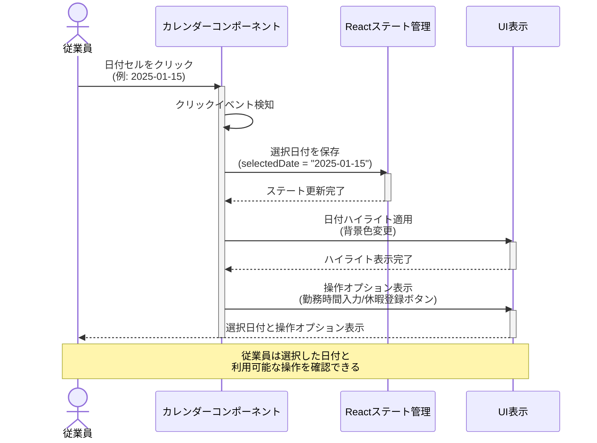
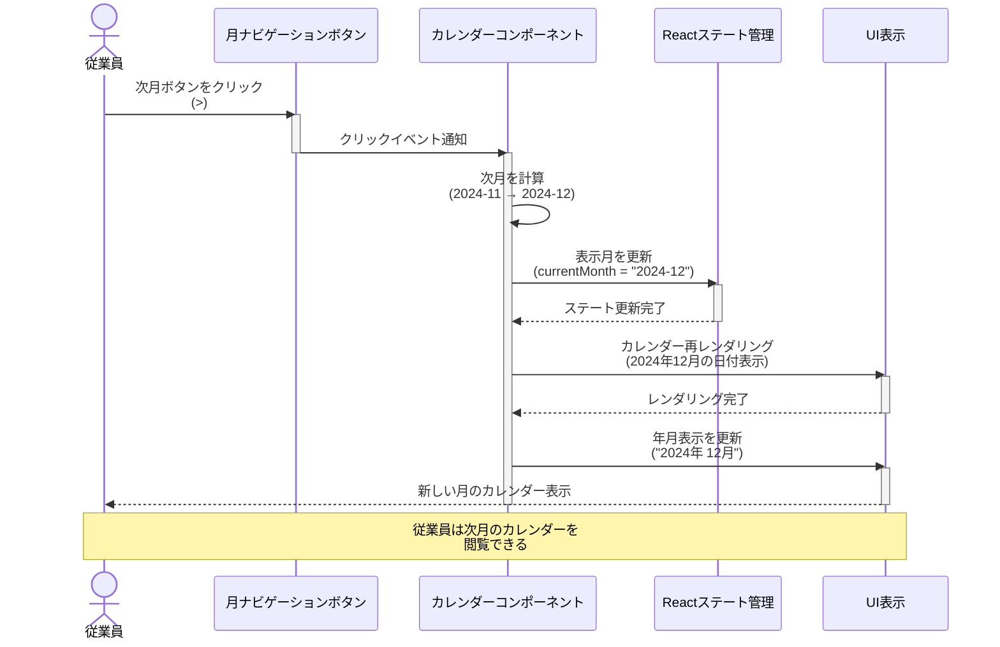
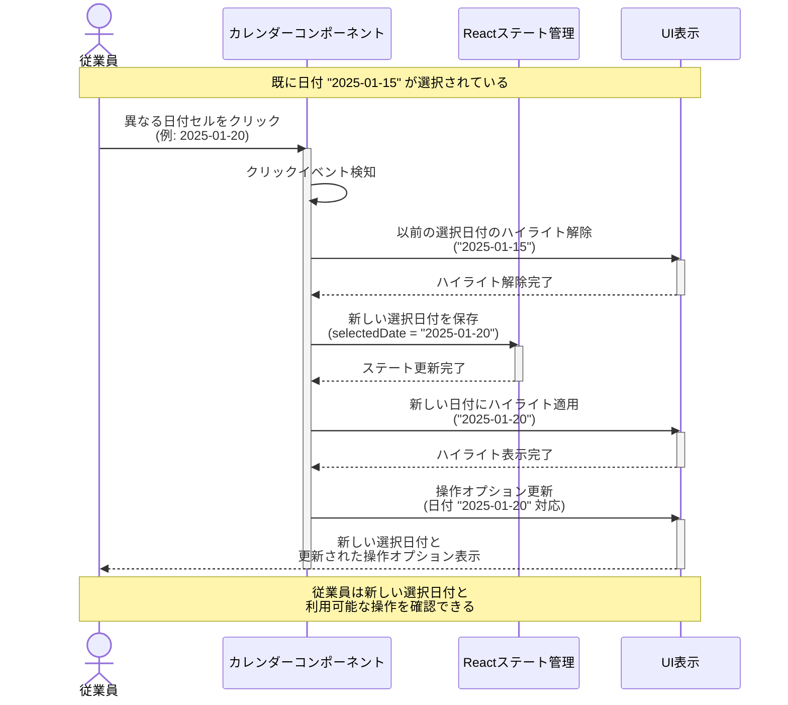

# シーケンス図

システムのコンポーネント間のやり取りを時系列で定義します。

## 命名規則

### シーケンス図ID

- **形式**: `SEQ-{連番3桁}` (例: `SEQ-001`)
- **命名規則**: フローの目的が明確になるように命名

## シーケンス図一覧

| シーケンス図ID | タイトル                 | 概要                               | 関連要件  | 関連画面 |
| -------------- | ------------------------ | ---------------------------------- | --------- | -------- |
| SEQ-UC002-001  | カレンダー日付選択       | 従業員が日付を選択する             | REQ-UC002 | SCR-001  |
| SEQ-UC002-002  | カレンダー月切り替え     | 従業員がカレンダーの月を切り替える | REQ-UC002 | SCR-001  |
| SEQ-UC002-003  | カレンダー異なる日付選択 | 従業員が異なる日付を再選択する     | REQ-UC002 | SCR-001  |

---

## シーケンス図詳細

### SEQ-UC002-001: カレンダー日付選択

#### 目的

* 従業員がカレンダーから任意の日付を選択し、その日付に対する操作オプションを表示する
* 選択した日付を視覚的にハイライト表示し、ユーザーに選択状態を明確に伝える

#### 範囲

* **トリガー**: 従業員がカレンダー上の日付セルをクリック
* **含むコンポーネント**: メイン画面（SCR-001）のカレンダーコンポーネント
* **除外**: 実際の勤怠データ取得（将来の要件で実装）、日付選択後の操作（UC003、UC004で実装）

#### 前提条件

* メイン画面（SCR-001）が表示されている
* カレンダーが正常にレンダリングされている
* 現在月のカレンダーが表示されている

#### 事後条件

* 選択した日付がハイライト表示される
* 選択日付に応じた操作オプションが表示される（「勤務時間入力」「休暇登録」ボタン等）
* システムの状態として、選択された日付が保持される

#### 基本フロー

1. 従業員がメイン画面（SCR-001）でカレンダーを閲覧している
2. 従業員がカレンダー上の任意の日付セルをクリックする
3. フロントエンド（React）が日付セルのクリックイベントを検知する
4. 選択された日付をコンポーネントのステート（state）に保存する
5. UIを更新し、選択された日付セルに視覚的なハイライト（背景色変更等）を適用する
6. 選択日付に応じた操作オプション（「勤務時間入力」「休暇登録」ボタン等）を表示する
7. 従業員が選択した日付と操作オプションを確認できる

#### 代替フロー

* **A1: 既に日付が選択されている状態で新しい日付を選択** — SEQ-UC002-003（カレンダー異なる日付選択）を参照
* **A2: 前月または翌月の日付セルをクリック** — 月が切り替わり、該当する日付が選択される（月切り替えとして扱う）

#### シーケンス図

---

### SEQ-UC002-002: カレンダー月切り替え

#### 目的

* 従業員がカレンダーの表示月を前月または次月に切り替える
* 切り替え後の月のカレンダーを正しく表示する

#### 範囲

* **トリガー**: 従業員が前月ボタン（<）または次月ボタン（>）をクリック
* **含むコンポーネント**: メイン画面（SCR-001）のカレンダーコンポーネント、月ナビゲーションボタン
* **除外**: 勤怠データの取得（将来の要件で実装）

#### 前提条件

* メイン画面（SCR-001）が表示されている
* カレンダーが正常にレンダリングされている
* 現在の表示月が確定している（例: 2024年11月）

#### 事後条件

* カレンダーが指定された月（前月または次月）に切り替わる
* 新しい月の年月表示が更新される（例: 「2024年 11月」→「2024年 12月」）
* 新しい月の日付セルが正しく表示される
* 日付選択状態はリセットされる（オプション）

#### 基本フロー

1. 従業員がメイン画面（SCR-001）でカレンダーを閲覧している
2. 従業員が次月ボタン（>）をクリックする
3. フロントエンド（React）がボタンのクリックイベントを検知する
4. 現在の表示月を1ヶ月後に更新する（例: 2024年11月 → 2024年12月）
5. コンポーネントのステート（currentMonth）を更新する
6. UIを再レンダリングし、新しい月のカレンダーを表示する
7. 年月表示を更新する（例: 「2024年 12月」）
8. 従業員が新しい月のカレンダーを確認できる

#### 代替フロー

* **A1: 前月ボタンをクリック** — 表示月を1ヶ月前に更新する（基本フローと同様）
* **A2: 年をまたぐ月切り替え** — 12月→1月、または1月→12月の場合、年も適切に更新する（例: 2024年12月 → 2025年1月）

#### シーケンス図

---

### SEQ-UC002-003: カレンダー異なる日付選択

#### 目的

* 既に日付が選択されている状態で、従業員が別の日付を選択する
* 以前の選択日付のハイライトを解除し、新しい選択日付をハイライトする
* 操作オプションを新しい日付に対応した内容に更新する

#### 範囲

* **トリガー**: 日付が既に選択されている状態で、従業員が別の日付セルをクリック
* **含むコンポーネント**: メイン画面（SCR-001）のカレンダーコンポーネント
* **除外**: 実際の勤怠データ取得（将来の要件で実装）

#### 前提条件

* メイン画面（SCR-001）が表示されている
* カレンダーが正常にレンダリングされている
* 既に日付が選択されている（例: 2025-01-15）
* 選択日付がハイライト表示されている

#### 事後条件

* 以前の選択日付のハイライトが解除される
* 新しい選択日付がハイライト表示される
* 操作オプションが新しい日付に対応した内容に更新される
* システムの状態として、新しい選択日付が保持される

#### 基本フロー

1. 従業員がメイン画面（SCR-001）でカレンダーを閲覧している
2. 既に日付（例: 2025-01-15）が選択されている状態
3. 従業員が別の日付セル（例: 2025-01-20）をクリックする
4. フロントエンド（React）が日付セルのクリックイベントを検知する
5. 以前の選択日付（2025-01-15）のハイライトを解除する
6. 新しい選択日付（2025-01-20）をコンポーネントのステート（state）に保存する
7. UIを更新し、新しい選択日付セル（2025-01-20）に視覚的なハイライトを適用する
8. 操作オプションを新しい日付に対応した内容に更新する
9. 従業員が新しい選択日付と操作オプションを確認できる

#### 代替フロー

* **A1: 同じ日付を再度クリック** — 選択を解除する（トグル動作）、または何もしない（設計による）
* **A2: 月をまたいで日付を選択** — 月が切り替わり、新しい月の指定日付が選択される

#### シーケンス図

