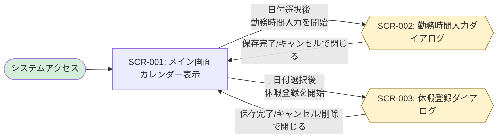

# 画面設計書

ハイレベル設計として画面一覧と画面遷移図を定義し、ローレベル設計として各画面の詳細仕様を記載します。

## 命名規則

### 画面ID

- **形式**: `SCR-{連番3桁}` (例: `SCR-001`)
- **命名規則**: 画面の目的と機能が明確になるように命名

---

## ハイレベル設計

### 画面一覧

| 画面ID  | 画面名               | カテゴリ   | 概要                                           | アクセス権限 | 関連要件     |
| ------- | -------------------- | ---------- | ---------------------------------------------- | ------------ | ------------ |
| SCR-001 | メイン画面           | 勤怠管理   | カレンダーを表示し勤怠操作の起点となる画面     | ACT-001      | UC001, UC002 |
| SCR-002 | 勤務時間入力フォーム | ダイアログ | メイン画面上で出勤・退勤時刻を入力するモーダル | ACT-001      | UC003        |
| SCR-003 | 休暇登録フォーム     | ダイアログ | メイン画面上で休暇種別とメモを入力するモーダル | ACT-001      | UC004        |

※ SCR-002 / SCR-003 は独立した画面遷移先ではなく、SCR-001 上で表示される画面内ダイアログとして扱う。

### 画面遷移図



---

## ローレベル設計

<!-- TODO: ローレベル設計フェーズで各画面の詳細仕様を記載します -->
<!-- 以下のセクションはローレベル設計時に具体化します -->

### 画面詳細定義

#### SCR-001: メイン画面

**関連要件**: REQ-UC001（システム起動）, REQ-UC002（カレンダー操作）

**画面概要**:
- カレンダーベースのUIで勤怠管理のメイン画面として機能
- 従業員が日付を選択して勤務時間入力や休暇登録を行うための起点となる
- システム起動時に最初に表示される画面

**アクセス権限**: ACT-001（従業員）

**画面構成**:

```
┌─────────────────────────────────────────────────────────┐
│ 勤怠管理システム                                        │
├─────────────────────────────────────────────────────────┤
│                                                         │
│  ┌───────────────────────────────────────────────────┐ │
│  │          2024年 11月                   < >        │ │
│  ├───────────────────────────────────────────────────┤ │
│  │  日  月  火  水  木  金  土                        │ │
│  ├───────────────────────────────────────────────────┤ │
│  │           1   2   3   4   5                       │ │
│  │   6   7   8   9  10  11  12                       │ │
│  │  13  14  15  16  17  18  19                       │ │
│  │  20  21  22  23  24  25  26                       │ │
│  │  27  28  29  30                                   │ │
│  └───────────────────────────────────────────────────┘ │
│                                                         │
└─────────────────────────────────────────────────────────┘
```

**画面項目**:

| 項目ID   | 項目名             | 種別       | 必須 | 既定値 | 説明                                                         | バリデーション |
| -------- | ------------------ | ---------- | ---- | ------ | ------------------------------------------------------------ | -------------- |
| SCR001-1 | 画面タイトル       | 表示       | -    | -      | 「勤怠管理システム」を表示                                   | -              |
| SCR001-2 | 年月表示           | 表示       | -    | 現在月 | 現在表示中のカレンダーの年月を表示<br/>形式: 「YYYY年 MM月」 | -              |
| SCR001-3 | 前月ボタン         | ボタン     | -    | -      | クリックで前月のカレンダーを表示                             | -              |
| SCR001-4 | 次月ボタン         | ボタン     | -    | -      | クリックで次月のカレンダーを表示                             | -              |
| SCR001-5 | 曜日ヘッダー       | 表示       | -    | -      | 日曜日から土曜日までの曜日を表示                             | -              |
| SCR001-6 | 日付セル           | クリック可 | -    | -      | カレンダーの各日付を表示<br/>クリックで日付を選択            | -              |
| SCR001-7 | カレンダーグリッド | 表示領域   | -    | -      | 月のすべての日付を7列×最大6行のグリッドで表示                | -              |

**画面項目の詳細**:

##### SCR001-6: 日付セル

各日付セルは以下の状態を持つ:
- **当月の日付**: 通常表示、クリック可能
- **前月/翌月の日付**: グレーアウト表示（オプション）
- **本日**: ハイライト表示（例: 太枠または特別な背景色）
- **選択中の日付**: 強調表示（例: 青色背景）
- **土日**: 直感的な色分けで背景・文字色を変更（例: 日曜は`#fdecea` + `#c62828`、土曜は `#e8f1ff` + `#1565c0`）。本日/選択状態より優先度は低く、それらに該当する場合は本日/選択のスタイルを適用する。

日付セルの操作:
- **クリック時の動作** (REQ-UC002):
  1. クリックされた日付を選択状態にする
  2. 以前に選択されていた日付のハイライトを解除する
  3. 新しく選択された日付をハイライト表示する
  4. 選択日付に応じた操作オプション（「勤務時間入力」「休暇登録」ボタン等）を表示する
- **ホバー時の動作**: 日付セルの背景色を変更し、クリック可能であることを示す
- **日付選択の保持**: 選択された日付はReactのステート（`selectedDate`）に保存される

日付セルをクリックすると:
- 現在の要件（UC002）では、日付選択とハイライト表示のみ実行
- 今後の要件（UC003, UC004）で、勤務時間入力フォーム（SCR-002）または休暇登録フォーム（SCR-003）をメイン画面上のモーダルダイアログとして開く機能を実装

##### SCR001-3: 前月ボタン

**操作** (REQ-UC002):
1. クリック時、表示中のカレンダーを前月に切り替える
2. 年月表示を更新する（例: 「2024年 12月」→「2024年 11月」）
3. 年をまたぐ場合も適切に処理する（例: 「2025年 1月」→「2024年 12月」）
4. カレンダーグリッドを前月の日付で再レンダリングする

**状態管理**: Reactのステート（`currentMonth`）を更新

##### SCR001-4: 次月ボタン

**操作** (REQ-UC002):
1. クリック時、表示中のカレンダーを次月に切り替える
2. 年月表示を更新する（例: 「2024年 11月」→「2024年 12月」）
3. 年をまたぐ場合も適切に処理する（例: 「2024年 12月」→「2025年 1月」）
4. カレンダーグリッドを次月の日付で再レンダリングする

**状態管理**: Reactのステート（`currentMonth`）を更新

##### SCR001-2: 年月表示

**表示形式**: 「YYYY年 MM月」（例: 「2024年 11月」）

**更新タイミング** (REQ-UC002):
- 前月ボタンまたは次月ボタンをクリックした際に自動更新される
- 表示月の変更に連動して即座に反映される

**状態管理**: Reactのステート（`currentMonth`）から生成

**呼び出すAPI**:

| 操作                       | メソッド | エンドポイント                 | 説明                                                     | 関連要件  |
| -------------------------- | -------- | ------------------------------ | -------------------------------------------------------- | --------- |
| カレンダー初期表示         | -        | -                              | APIは使用しない（フロントエンド側で生成）                | UC001     |
| 勤怠データ取得（将来実装） | GET      | `/api/attendance/{employeeId}` | 従業員の勤怠レコード一覧を取得（カレンダーに状態を表示） | UC002以降 |

※ REQ-UC002（カレンダー操作）では、日付選択や月切り替えはフロントエンド側の状態管理のみで実現し、バックエンドAPIは呼び出しません。

**画面遷移・画面内状態変化**:

| トリガー             | 遷移先画面                      | 条件                                             | 関連要件     |
| -------------------- | ------------------------------- | ------------------------------------------------ | ------------ |
| システムURL アクセス | 本画面（SCR-001）               | システム起動時の初期画面                         | UC001        |
| 前月ボタン クリック  | 本画面（SCR-001）               | カレンダー表示を前月に更新（遷移なし）           | UC002        |
| 次月ボタン クリック  | 本画面（SCR-001）               | カレンダー表示を次月に更新（遷移なし）           | UC002        |
| 日付セル クリック    | 本画面（SCR-001）               | 日付選択状態を更新（遷移なし）                   | UC002        |
| 操作ボタン クリック  | 勤務時間入力フォーム（SCR-002） | 日付選択後、勤務時間入力ダイアログを表示         | UC003        |
| 操作ボタン クリック  | 休暇登録フォーム（SCR-003）     | 日付選択後、休暇登録ダイアログを表示             | UC004        |
| ダイアログ操作完了   | 本画面（SCR-001）               | 保存完了、キャンセル、削除後にダイアログを閉じる | UC003, UC004 |

**使用メッセージ**:

REQ-UC001（システム起動）およびREQ-UC002（カレンダー操作）では、エラーメッセージやシステムメッセージは使用しません。画面が正常に表示され、操作が正常に動作することを確認します。

**UI/UX要件**:

- **レスポンシブデザイン**: 最新のWebブラウザー（Chrome、Firefox、Safari、Edge）で正常に表示されること
- **パフォーマンス**: ページロード時間は実用的な範囲内であること（具体的な数値目標は今後定義）
- **アクセシビリティ**: 日付セルは視覚的に区別しやすいデザインとすること
- **カレンダー操作**: 直感的に操作できること（月の移動、日付選択）
- **日付選択の視覚的フィードバック** (REQ-UC002):
  - 選択中の日付は明確にハイライト表示される（例: 背景色を青色に変更）
  - 本日の日付は特別なマーキングで表示される（例: 太枠または異なる背景色）
  - ホバー時に日付セルの色が変わり、クリック可能であることを示す
  - 前月/翌月の日付はグレーアウト表示される（オプション）
- **週末の視認性向上**: 一般的なカレンダー配色に合わせ、日曜は柔らかい赤系背景・文字色（`#fdecea`/`#c62828`）、土曜は柔らかい青系背景・文字色（`#e8f1ff`/`#1565c0`）を適用し、操作状態（本日/選択）より優先度を下げる。
- **月切り替え操作** (REQ-UC002):
  - 前月ボタン（<）と次月ボタン（>）は明確に表示され、クリック可能であることが分かりやすいこと
  - ボタンクリック時、カレンダーがスムーズに更新されること（アニメーション不要）
  - 年月表示が正しく更新されること
- **操作オプション表示** (REQ-UC002):
  - 日付選択時、その日付に対する操作オプション（「勤務時間入力」「休暇登録」ボタン等）が適切に表示されること
  - 操作オプションは日付選択状態と連動すること

**備考**:

- 初期表示時は現在月のカレンダーを表示
- 従業員IDは将来の認証機能で取得する予定（現在は固定値 "EMP001" を使用）
- カレンダーコンポーネントは React で実装し、状態管理は React Hooks を使用
- **REQ-UC002 カレンダー操作の技術仕様**:
  - **状態管理**: 以下のReactステートを使用
    - `currentMonth`: 表示中の年月（Date型またはstring型 "YYYY-MM"）
    - `selectedDate`: 選択中の日付（Date型またはstring型 "YYYY-MM-DD"）
  - **カレンダー生成ロジック**: 
    - JavaScriptの`Date`オブジェクトを使用して、指定月の日付配列を生成
    - 月初の曜日、月末の日付を計算し、7列×最大6行のグリッドを構築
  - **イベントハンドラー**:
    - `handleDateClick(date)`: 日付セルクリック時の処理
    - `handlePrevMonth()`: 前月ボタンクリック時の処理
    - `handleNextMonth()`: 次月ボタンクリック時の処理
  - **スタイリング**: CSS Modules または Tailwind CSS を使用し、ハイライト状態のスタイルを適用
  - **パフォーマンス**: `useMemo`フックを使用してカレンダー日付配列の再計算を最適化

#### SCR-002: 勤務時間入力フォーム

**UI種別**: モーダルダイアログ

**表示方式**:
- SCR-001 のオーバーレイ上に表示する
- 独立ルートや別ページ遷移は発生しない
- 保存完了またはキャンセル時にダイアログを閉じ、SCR-001 の選択日付コンテキストへ戻る

<!-- TODO: ローレベル設計フェーズで入力項目、呼び出すAPI、メッセージを具体化する -->

#### SCR-003: 休暇登録フォーム

**UI種別**: モーダルダイアログ

**表示方式**:
- SCR-001 のオーバーレイ上に表示する
- 独立ルートや別ページ遷移は発生しない
- 保存完了、キャンセル、削除時にダイアログを閉じ、SCR-001 の選択日付コンテキストへ戻る

<!-- TODO: ローレベル設計フェーズで入力項目、呼び出すAPI、メッセージを具体化する -->
