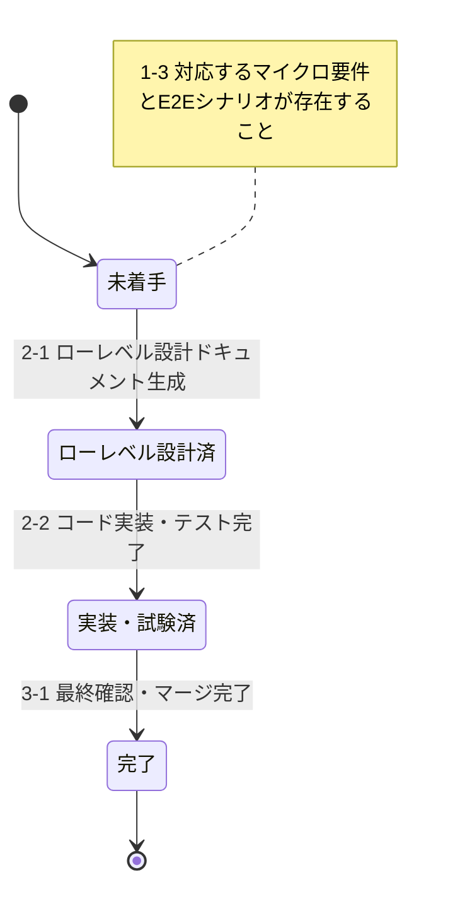

# Development Status

このドキュメントは、プロジェクトの開発状況を要件IDごとに管理します。

## マイクロ要件共通

### 要件定義

要件定義書（REQ-000）: **作成済**

要件定義書（REQ-000）へ反映済みの要件ID一覧は以下：

- UC001-UC004

### ハイレベル設計

作成済みドキュメント:

- `docs/design/actors.md` - アクター一覧
- `docs/design/deployment-diagram.md` - デプロイメント図
- `docs/design/screen-design.md` - 画面設計書（ハイレベル部分）
- `docs/design/database-table-definitions.md` - テーブル定義書（ハイレベル部分）
- `docs/design/openapi.yaml` - API設計書（ハイレベル部分）
- `docs/design/message-definition.md` - メッセージ定義書（構造のみ）

ハイレベル設計ドキュメントへ反映済みの要件ID：

- UC001-UC004（全要件のハイレベル設計完了）

### コードスケルトン生成

**状態**: 完了（2025-11-18）

生成済みコードスケルトン:

**バックエンド** (`backend/`):
- プロジェクト設定: `pom.xml`, `compose.yaml`, `application.yml`
- データベース初期化: `init-db/01-schema.sql`, `init-db/02-master-data.sql`
- アプリケーションコード:
  - `AttendanceSystemApplication.java` - メインアプリケーション
  - `controller/AttendanceController.java` - REST APIエンドポイント
  - `service/AttendanceService.java` - ビジネスロジック層
  - `repository/AttendanceRecordRepository.java` - データアクセス層
  - `entity/AttendanceRecord.java` - JPAエンティティ
  - `dto/AttendanceRequest.java`, `dto/AttendanceResponse.java` - DTO
- テストコード:
  - `AttendanceSystemApplicationTests.java` - アプリケーション起動テスト
  - `controller/AttendanceControllerTest.java` - コントローラーテスト
  - `service/AttendanceServiceTest.java` - サービステスト
  - `repository/AttendanceRecordRepositoryTest.java` - リポジトリテスト
- ドキュメント: `backend/README.md`

**フロントエンド** (`frontend/`):
- プロジェクト設定: `package.json`, `vite.config.ts`, `tsconfig.json`, `.eslintrc.cjs`
- アプリケーションコード:
  - `main.tsx` - エントリーポイント
  - `App.tsx` - ルートコンポーネント
  - `pages/CalendarPage.tsx` - メイン画面
  - `components/Calendar.tsx` - カレンダーコンポーネント
  - `components/WorkTimeForm.tsx` - 勤務時間入力フォーム
  - `components/LeaveForm.tsx` - 休暇登録フォーム
  - `services/attendanceService.ts` - API通信サービス
  - `types/attendance.ts` - 型定義
- ドキュメント: `frontend/README.md`

**ビルド・テスト確認済み**:
- バックエンド: `mvn clean compile` ✓, `mvn test` ✓ (全9テスト成功)
- フロントエンド: `pnpm install` ✓, `pnpm build` ✓

コードスケルトンへ反映済みの要件ID：

- UC001-UC004（全要件のスケルトンコード生成完了）

## 各マイクロ要件

以下は `docs/requirements/` および対応する E2E シナリオに基づく最新のユースケース管理テーブルです。

| 要件ID    | 名前           | 状態   | 対応E2Eシナリオ                               | 他マイクロ要件の依存関係 |
| --------- | -------------- | ------ | --------------------------------------------- | ------------------------ |
| REQ-UC001 | システム起動   | 完了   | e2e/features/REQ-UC001-システム起動.feature   | -                        |
| REQ-UC002 | カレンダー操作 | 完了   | e2e/features/REQ-UC002-カレンダー操作.feature | REQ-UC001                |
| REQ-UC003 | 勤務時間入力   | 未着手 | e2e/features/REQ-UC003-勤務時間入力.feature   | REQ-UC001, REQ-UC002     |
| REQ-UC004 | 休暇登録       | 未着手 | e2e/features/REQ-UC004-休暇登録.feature       | REQ-UC001, REQ-UC002     |

### 状態定義

#### REQ-XXX: 各マイクロ要件

- **未着手**: マイクロ要件仕様書および E2E テストシナリオが生成・更新されている状態
- **ローレベル設計済**: ローレベル設計ドキュメントが生成・更新されている状態
- **コードスケルトン済**: コードスケルトンが生成・更新されている状態
- **実装・試験済**: コード実装およびテストコードが生成・更新され、単体テストおよび E2E テストが完了している状態
- **完了**: マージ済みですべての関連ドキュメントとコードが最終確認されている状態

---

**最終更新日**: 2025-11-18
