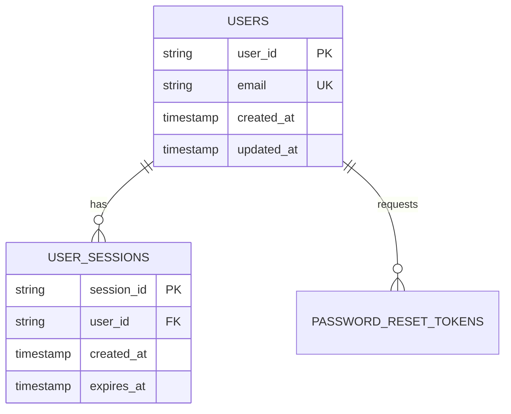

# テーブル定義書

システムのデータベーステーブル定義を管理します。

## 命名規則

### テーブル名

- **形式**: 小文字スネークケース (例: `favorites`, `product_reviews`)
- **複数形**: 原則として複数形を使用
- **命名規則**: ビジネス用語を使用、省略形は避ける

---

## ハイレベル設計

### エンティティ一覧

<!-- （テンプレート用コメント）論理→物理の対応表。テーブルを追加するたびに追記してください -->

| 項番   | データベース | 論理エンティティ名                             | 物理エンティティ名 | 備考     |
| ------ | ------------ | ---------------------------------------------- | ------------------ | -------- |
| 1      | [DB名]       | [論理名](#テーブル定義へのアンカー)            | [table_name]       | [備考]   |
| 2      | [DB名]       | [論理名](#テーブル定義へのアンカー)            | [table_name]       | [備考]   |

### ER図

<!-- （テンプレート用コメント）Mermaidで記述します。テーブルとリレーションを適切に定義してください -->

---

## ローレベル設計

<!-- （テンプレート用コメント）以下のテーブル雛形を、対象テーブル分だけコピーして記載します -->

### テーブル詳細定義

#### 1. [論理テーブル名]（`[table_name]`）

##### テーブル構造

| 項番 | 論理名         | 物理名          | データ型         | Not Null | 既定値         | 備考              |
| ---- | -------------- | --------------- | ---------------- | -------- | -------------- | ----------------- |
| 1    | [論理カラム名] | [column_name]   | [VARCHAR(255)等] | Yes/No   | [デフォルト値] | PK/UK/FK/説明     |
| 2    | [論理カラム名] | [column_name]   | [VARCHAR(255)等] | Yes/No   | [デフォルト値] | PK/UK/FK/説明     |

##### 制約・キー

* **PK**: `[例: user_id]`
* **UK**: `[例: email]`
* **FK**: `[例: FOREIGN KEY (xxx_id) REFERENCES xxx(id) ON DELETE CASCADE]`
* **CHK**: `[例: CHECK (status IN ('active', 'inactive'))]`
* **IDX**: `[例: INDEX idx_email ON users(email)]`
