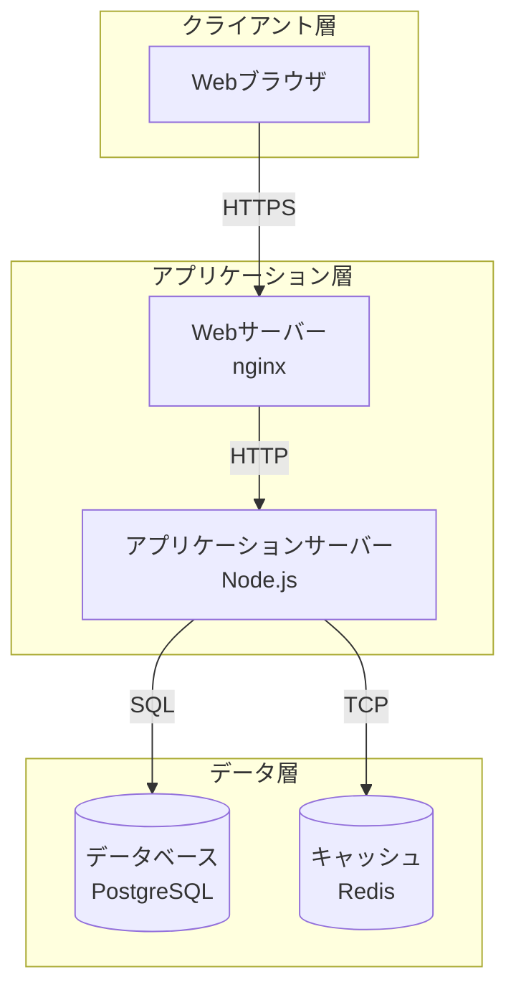

# デプロイメント図

システムの物理的な配置構成を定義します。

## 命名規則

### ノード名

- **形式**: PascalCase (例: `WebServer`, `DatabaseServer`)
- **命名規則**: 役割が明確になるように命名

## デプロイメント図

<!-- （テンプレート用コメント）Mermaidで記述します。サーバー、コンテナ、ネットワーク構成などを定義してください -->

## 構成要素詳細

<!-- （テンプレート用コメント）各ノードの詳細情報を記載してください -->

### Webサーバー

* **概要**: [サーバーの役割]
* **ソフトウェア**: [例: nginx 1.21]
* **スペック**: [例: 2vCPU, 4GB RAM]
* **配置場所**: [例: AWS EC2, Docker Container]
* **冗長構成**: [例: 2台構成 + ロードバランサー]

### アプリケーションサーバー

* **概要**: [サーバーの役割]
* **ソフトウェア**: [例: Node.js 18.x]
* **スペック**: [例: 4vCPU, 8GB RAM]
* **配置場所**: [例: AWS ECS, Kubernetes]
* **冗長構成**: [例: Auto Scaling 2-10台]

### データベース

* **概要**: [データベースの役割]
* **ソフトウェア**: [例: PostgreSQL 14]
* **スペック**: [例: 8vCPU, 32GB RAM, 1TB SSD]
* **配置場所**: [例: AWS RDS]
* **冗長構成**: [例: Multi-AZ構成]