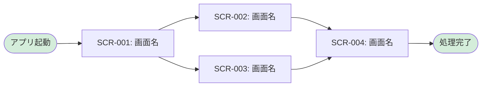

# 画面設計書

ハイレベル設計として画面一覧と画面遷移図を定義し、ローレベル設計として各画面の詳細仕様を記載します。

## 命名規則

### 画面ID

- **形式**: `SCR-{連番3桁}` (例: `SCR-001`)
- **命名規則**: 画面の目的と機能が明確になるように命名

---

## ハイレベル設計

### 画面一覧

<!-- （テンプレート用コメント）システム内のすべての画面を一覧化してください -->

| 画面ID  | 画面名       | カテゴリ   | 概要         | アクセス権限 | 関連要件  |
| ------- | ------------ | ---------- | ------------ | ------------ | --------- |
| SCR-001 | [画面名]     | [カテゴリ] | [画面の概要] | [ACT-XXX]    | [REQ-XXX] |
| SCR-002 | [画面名]     | [カテゴリ] | [画面の概要] | [ACT-XXX]    | [REQ-XXX] |

### 画面遷移図

<!-- （テンプレート用コメント）Mermaidで画面間の遷移フローを記述してください -->

---

## ローレベル設計

<!-- （テンプレート用コメント）以下の画面雛形を、対象画面分だけコピーして記載します -->

### 画面詳細定義

#### SCR-001: [画面名]

##### 画面概要

* **概要**: [画面の概要説明]
* **画面種別**: [例: 一覧画面/詳細画面/入力フォーム]
* **アクセス条件**: [例: ログイン済みユーザー]
* **遷移元**: [例: SCR-XXX]
* **遷移先**: [例: SCR-XXX, SCR-YYY]

##### 画面項目

| 項目ID  | 項目名       | 種別       | 必須 | バリデーション       | 備考         |
| ------- | ------------ | ---------- | ---- | -------------------- | ------------ |
| [ID]    | [項目名]     | [種別]     | Yes  | [バリデーションルール] | [備考]       |
| [ID]    | [項目名]     | [種別]     | No   | [バリデーションルール] | [備考]       |

##### 呼び出すAPI

| 操作     | メソッド | エンドポイント   | 説明         |
| -------- | -------- | ---------------- | ------------ |
| [操作名] | [HTTP]   | [APIエンドポイント] | [説明]       |

##### メッセージ

| メッセージID | 表示条件     | メッセージ内容   |
| ------------ | ------------ | ---------------- |
| [MSG-XXX]    | [表示条件]   | [メッセージ内容] |
