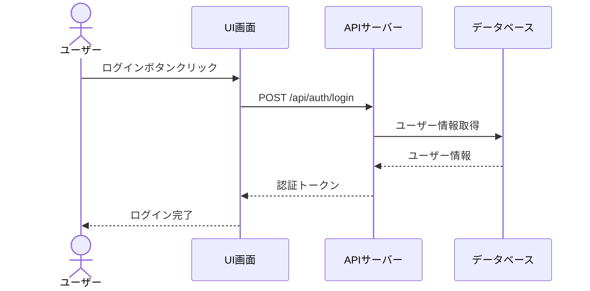

# シーケンス図

システムのコンポーネント間のやり取りを時系列で定義します。

## 命名規則

### シーケンス図ID

- **形式**: `SEQ-{連番3桁}` (例: `SEQ-001`)
- **命名規則**: フローの目的が明確になるように命名

## シーケンス図一覧

<!-- （テンプレート用コメント）システム内の主要なシーケンス図を一覧化してください -->

| シーケンス図ID | タイトル         | 概要             | 関連要件  | 関連画面  |
| -------------- | ---------------- | ---------------- | --------- | --------- |
| SEQ-001        | [シーケンス名]   | [概要]           | [REQ-XXX] | [SCR-XXX] |
| SEQ-002        | [シーケンス名]   | [概要]           | [REQ-XXX] | [SCR-XXX] |

---

## シーケンス図詳細

<!-- （テンプレート用コメント）以下のシーケンス図雛形を、対象フロー分だけコピーして記載します -->

### SEQ-001: [シーケンス図のタイトル]

#### 目的

* [目的の要約を記載]
* [サブ目的や補足事項があれば記載]

#### 範囲

* **トリガー**: [何がこのフローを開始するか。例: ユーザーがボタンをクリック]
* **含むコンポーネント**: [主要コンポーネント。例: LoginComponent / POST /api/auth / users テーブル]
* **除外**: [範囲外の要素があれば記載]

#### 前提条件

* [例: ユーザーが未ログイン状態である]

#### 事後条件

* [例: ユーザーがログイン済み状態になる]

#### 基本フロー

1. [ステップ1の説明]
2. [ステップ2の説明]
3. [ステップ3の説明]

#### 代替フロー

* **A1: [ケース1タイトル]** — [例外ケースの説明]
* **A2: [ケース2タイトル]** — [例外ケースの説明]

#### シーケンス図

<!-- （テンプレート用コメント）Mermaidでシーケンス図を記述してください -->

