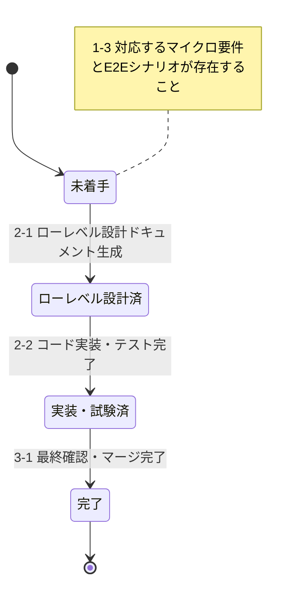

# Development Status

このドキュメントは、プロジェクトの開発状況を要件IDごとにに関する情報を提供します。

## マイクロ要件共通

### 要件定義

要件定義書（REQ-000）: [未作成 / 作成済]

要件定義書（REQ-000）へ反映済みの要件ID一覧は以下：

- [ここに反映済みの要件IDの範囲を記載（例. UC001-UC004）]

### ハイレベル設計

作成済みドキュメント:

- [作成済みのハイレベル設計ドキュメント一覧を記載]

ハイレベル設計ドキュメントへ反映済みの要件ID：

- [ここに反映済みの要件IDの範囲を記載（例. UC001-UC004）]

## 各マイクロ要件

以下は `docs/requirements/` および対応する E2E シナリオに基づく最新のユースケース管理テーブルです。

| 要件ID  | 名前           | 状態   | 他マイクロ要件の依存関係 |
| ------- | -------------- | ------ | ------------------------ |
| REQ-XXX | [要件名]       | 未着手 | [依存する要件ID または -] |

### 状態定義

#### REQ-XXX: 各マイクロ要件

- 未着手: マイクロ要件仕様書および E2E テストシナリオが生成・更新されている状態
- ローレベル設計済: ローレベル設計ドキュメントが生成・更新されている状態
- コードスケルトン済: コードスケルトンが生成・更新されている状態
- 実装・試験済: コード実装およびテストコードが生成・更新され、単体テストおよび E2E テストが完了している状態
- 完了: マージ済みですべての関連ドキュメントとコードが最終確認されている状態

